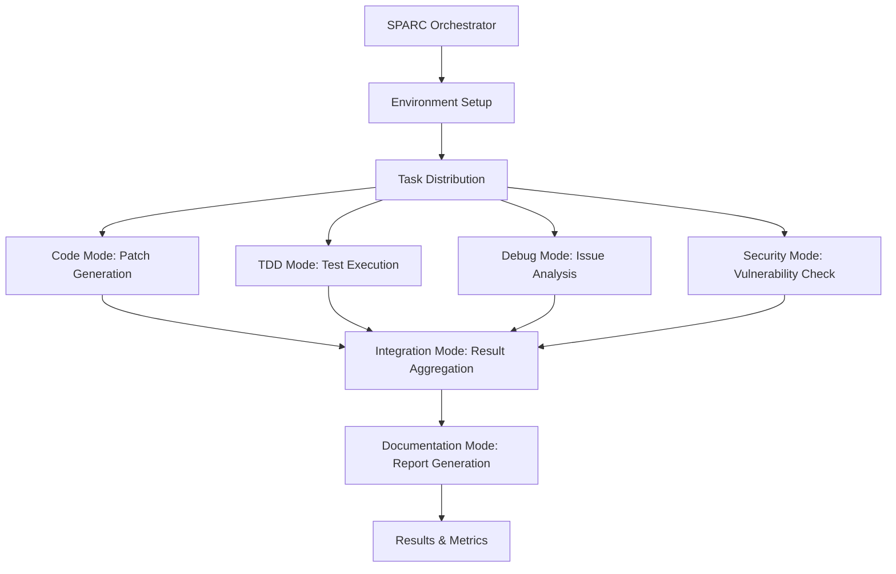

# SWE-bench Integration with roocode SPARC

🚀 **Native benchmarking of the roocode SPARC system using SWE-bench (Software Engineering Benchmark)**

This integration provides a complete pipeline for benchmarking the roocode SPARC agentic system against SWE-bench tasks without using Docker containers. All SWE tasks (patch generation, testing, debugging, etc.) are completed by the appropriate roocode modes rather than direct LLM calls.

## 🎯 Overview

- **Native Execution**: No Docker required - runs directly on the host system
- **roocode Integration**: All SWE tasks routed through specialized roocode modes
- **SPARC Orchestration**: Uses roocode SPARC orchestrator for task delegation
- **Modular Design**: Each component follows roocode principles (<500 lines, env-safe)
- **Dual Benchmarks**: Supports both SWE-bench lite and full evaluations

## 📋 Requirements

- **Hardware**: 16GB RAM, 8 CPUs, 60GB disk space
- **Software**: Python 3.8+, Git, Make
- **Environment**: Native Python environment (no containers)
- **Access**: GitHub token, roocode API access

## 🚀 Quick Start

1. **Setup Environment**
   ```bash
   make setup
   ```

2. **Configure Credentials**
   ```bash
   cp swe-bench-workspace/.env.example swe-bench-workspace/.env
   # Edit .env with your GitHub token
   ```

3. **Validate Installation**
   ```bash
   make validate
   ```

4. **Run Lite Benchmark**
   ```bash
   make benchmark-lite
   ```

5. **Run Full Benchmark**
   ```bash
   make benchmark-full
   ```

## 🏗️ Architecture

### roocode Mode Assignment

The SWE-bench integration routes different types of tasks to specialized roocode modes:

| SWE Task | roocode Mode | Purpose |
|----------|--------------|---------|
| Patch Generation | `code` | Generate code fixes and implementations |
| Test Execution | `tdd` | Run and validate test suites |
| Code Analysis | `debug` | Analyze errors and debug issues |
| Security Review | `security-review` | Check for security vulnerabilities |
| Documentation | `docs-writer` | Generate documentation for changes |
| Integration | `integration` | Merge and validate complete solutions |
| Orchestration | `sparc` | Coordinate overall benchmark workflow |

### Workflow Orchestration



## 📁 Project Structure

```
/workspaces/sparc-bench/
├── plans/
│   └── swe-bench-integration.md     # Complete implementation plan
├── scripts/
│   └── swe-bench-setup.sh           # Native setup script
├── swe-bench-workspace/             # Created during setup
│   ├── config/
│   │   └── roocode-config.yaml      # roocode SPARC configuration
│   ├── datasets/                    # SWE-bench datasets
│   ├── logs/                        # Execution logs
│   ├── results/                     # Benchmark results
│   │   ├── lite/                    # Lite benchmark results
│   │   └── full/                    # Full benchmark results
│   └── SWE-bench/                   # Cloned SWE-bench repository
├── .roomodes                        # Updated with SWE-bench orchestration
├── Makefile                         # Automation and workflow management
└── README-swe-bench.md             # This documentation
```

## ⚙️ Configuration

### roocode-config.yaml

```yaml
# roocode SPARC Configuration for SWE-bench
github_token: 'your_github_token_here'
benchmark_mode: 'native'
docker_enabled: false
agent_system: 'roocode_sparc'

# roocode mode assignments for SWE tasks
task_routing:
  patch_generation: 'code'
  test_execution: 'tdd' 
  code_analysis: 'debug'
  security_review: 'security-review'
  integration: 'integration'
  
# Benchmark settings
swe_bench:
  lite_enabled: true
  full_enabled: true
  max_concurrent_tasks: 4
  timeout_minutes: 30
```

### Environment Variables

```bash
# Required
GITHUB_TOKEN=your_github_token_here
ROOCODE_API_ENDPOINT=your_roocode_endpoint

# SWE-bench Native Mode
SWE_BENCH_DOCKER_DISABLED=true
SWE_BENCH_NATIVE_MODE=true
```

## 🧪 Running Benchmarks

### SWE-bench Lite (Quick Evaluation)

```bash
make benchmark-lite
```

- Faster execution (typically 30-60 minutes)
- Subset of SWE-bench tasks
- Good for initial validation and development

### SWE-bench Full (Comprehensive Evaluation)

```bash
make benchmark-full
```

- Complete benchmark suite (several hours)
- All SWE-bench tasks included
- Production-level evaluation

### Monitoring Progress

```bash
make monitor    # View recent logs and activity
make status     # Check overall system status
make config     # Display current configuration
```

## 📊 Results and Metrics

Results are saved in structured format:

```
swe-bench-workspace/results/
├── lite/
│   ├── predictions.jsonl           # roocode SPARC predictions
│   ├── evaluation_results.json     # Benchmark scores
│   └── detailed_logs/              # Per-task execution logs
└── full/
    ├── predictions.jsonl           # roocode SPARC predictions
    ├── evaluation_results.json     # Benchmark scores
    └── detailed_logs/              # Per-task execution logs
```

### Key Metrics

- **Pass Rate**: Percentage of tasks completed successfully
- **Execution Time**: Average time per task by roocode mode
- **Error Analysis**: Breakdown of failure modes
- **Mode Performance**: Efficiency of different roocode modes

## 🔧 Troubleshooting

### Common Issues

1. **Python Dependencies**
   ```bash
   pip install -r swe-bench-workspace/SWE-bench/requirements.txt
   ```

2. **GitHub API Rate Limits**
   - Ensure valid GitHub token in `.env`
   - Monitor API usage in logs

3. **Memory Issues**
   - Reduce `max_concurrent_tasks` in config
   - Monitor system resources during execution

4. **Configuration Errors**
   ```bash
   make validate  # Check setup
   make config    # Review configuration
   ```

### Logs and Debugging

```bash
# View recent logs
tail -f swe-bench-workspace/logs/*.log

# Check specific mode performance
grep "code mode" swe-bench-workspace/logs/*.log
grep "tdd mode" swe-bench-workspace/logs/*.log

# Validate roocode integration
python3 swe-bench-workspace/validate-setup.py
```

## 🚀 Advanced Usage

### Custom Mode Configuration

Edit `swe-bench-workspace/config/roocode-config.yaml` to customize:

- Task routing between roocode modes
- Timeout settings per mode
- Concurrency limits
- Logging levels

### Integration with CI/CD

```bash
# Automated benchmarking
make setup && make validate && make benchmark-lite
```

### Performance Tuning

1. **Concurrency**: Adjust `max_concurrent_tasks` based on system resources
2. **Timeouts**: Tune `timeout_minutes` for complex tasks
3. **Memory**: Monitor usage and adjust Python memory limits

## 📚 References

- [SWE-bench Official Documentation](https://www.swebench.com/SWE-bench/)
- [SWE-bench GitHub Repository](https://github.com/SWE-bench/SWE-bench)
- [Implementation Plan](plans/swe-bench-integration.md)
- [roocode SPARC Modes Documentation](.roomodes)

## 🎯 Success Criteria

✅ **Environment**: SWE-bench installed and running natively (no Docker)  
✅ **Integration**: All SWE tasks completed by roocode modes (not direct LLM calls)  
✅ **Orchestration**: SPARC orchestrator delegates benchmark sub-tasks via `new_task`  
✅ **Execution**: Both lite and full benchmarks execute successfully  
✅ **Performance**: Results demonstrate roocode SPARC system capabilities  
✅ **Modularity**: All components are modular (<500 lines) and environment-safe  
✅ **Documentation**: Complete coverage of integration points and workflows  

---

**Ready to benchmark roocode SPARC on SWE-bench! 🚀**